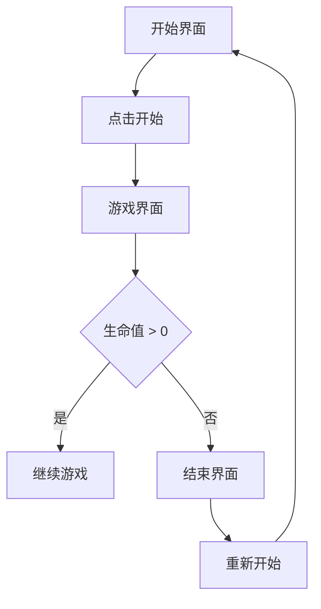

# 微软大战代码 - 产品需求文档

## 1. 产品概述
基于 "微软大战代码" (Microsoft Visual Studio Code 误读) 梗的趣味射击游戏。
- 玩家扮演 VS Code 角色，使用各种开发工具武器击败入侵的 Bug 怪物
- 融合编程文化与街机游戏风格，为开发者提供轻松愉悦的娱乐体验

## 2. 核心功能

### 2.1 用户角色
无需注册登录，单玩家模式。

### 2.2 功能模块
1. **游戏主页面**：开始界面、游戏界面、结束界面
2. **游戏核心**：玩家控制、敌人系统、武器系统、分数系统
3. **视觉效果**：像素风格动画、爆炸效果、音效反馈

### 2.3 页面详情
| 页面名称 | 模块名称 | 功能描述 |
|---------|---------|---------|
| 开始界面 | 标题展示 | 显示游戏标题、开始按钮、操作说明 |
| 游戏界面 | 玩家控制 | 方向键/ WASD 移动，空格键射击 |
| 游戏界面 | 敌人系统 | 多种类型 Bug 怪物随机出现 |
| 游戏界面 | 武器系统 | 多种开发工具武器（代码块、括号、分号等） |
| 游戏界面 | HUD | 显示分数、生命值、当前武器 |
| 结束界面 | 结果展示 | 显示最终分数、重新开始按钮 |

## 3. 核心流程
玩家点击开始游戏 → 进入游戏界面 → 控制角色移动并射击 → 击败敌人获得分数 → 生命值耗尽或达到目标 → 显示结束界面 → 可选择重新开始

## 4. 用户界面设计

### 4.1 设计风格
- **像素艺术风格**：8位/16位复古街机风格
- **主色调**：VS Code 蓝 (#007ACC)、代码高亮配色
- **次要色彩**：红色（Bug）、绿色（成功）、黄色（警告）
- **字体**：像素字体 + 等宽编程字体
- **按钮风格**：像素化、有按下反馈效果
- **布局**：经典街机游戏布局，居中对齐
- **图标/emoji**：编程相关图标（{}、;、//、bug、💻）

### 4.2 页面设计概述
| 页面名称 | 模块名称 | UI 元素 |
|---------|---------|---------|
| 开始界面 | 标题 | 大像素字体、闪烁动画、"VS CODE WARS" 副标题 |
| 开始界面 | 说明 | 操作说明、趣味梗介绍 |
| 游戏界面 | 背景 | 网格状代码编辑器背景 |
| 游戏界面 | 玩家 | VS Code 图标风格的飞船 |
| 游戏界面 | 敌人 | 各种 Bug 形象（蜘蛛、蟑螂等） |
| 游戏界面 | 子弹 | 代码字符（{ } ; //） |
| 结束界面 | 分数 | 醒目展示、动画效果 |

### 4.3 响应性
- 桌面端优先，适配不同屏幕尺寸
- 支持键盘操作（方向键 + 空格）
- 移动端支持触摸控制

### 4.4 视觉动效
- 爆炸特效：像素爆炸动画
- 角色移动：流畅的像素位移
- 闪烁效果：受伤时的闪烁提示
- 得分动画：数字跳动效果

